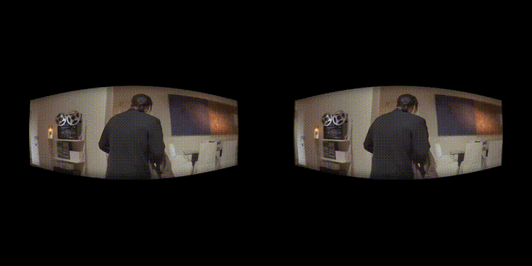

# Viarize

Viarize your video. Python script for making a VR180 video from your regular video.

This repo uses code from [Disco Diffusion Colab](https://github.com/alembics/disco-diffusion) using [MidaS](https://github.com/isl-org/MiDaS.git) and [AdaBins](https://github.com/shariqfarooq123/AdaBins.git) Depth Estimation libraries.


## Installation

Get the needed libraries:

```
git clone https://github.com/MSFTserver/pytorch3d-lite.git
git clone https://github.com/isl-org/MiDaS.git
git clone https://github.com/shariqfarooq123/AdaBins.git
```

And download the model weights:

```
wget https://cloudflare-ipfs.com/ipfs/Qmd2mMnDLWePKmgfS8m6ntAg4nhV5VkUyAydYBp8cWWeB7/AdaBins_nyu.pt -O pretrained/AdaBins_nyu.pt
wget https://github.com/intel-isl/DPT/releases/download/1_0/dpt_large-midas-2f21e586.pt -O pretrained/dpt_large-midas-2f21e586.pt
```

## Usage

Prepare the data:

```
ffmpeg -i vincent.mp4 frames/%04d.png
```

Run the script:

```
python viarize.py --input ./frames/ --out ./out/
```

Make two videos for the left and the right eyes:

```
ffmpeg -i out/%04d_l.png vincent_l.mp4
ffmpeg -i out/%04d_r.png vincent_r.mp4
```

Stitch videos using [VR180 CREATOR](https://www.patrickgrunwald.de/vr180-creator-download). 



Watch the video in the [Moon VR Player](https://moonvrplayer.com/) or in [your own project](https://github.com/vlarine/VR180Video)

